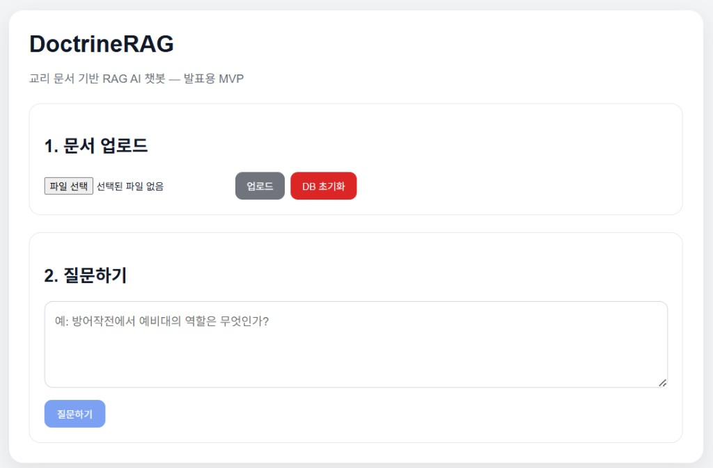

# DoctrineRAG

교리·교범류 문서를 업로드하고, **검색 증강 생성(RAG)**으로 근거 기반 답변을 제공하는 발표/데모용 풀스택 MVP입니다. 기본 LLM·임베딩은 **OpenAI API**이며, 벡터 저장은 로컬 **ChromaDB(영속)** 입니다.

## 프로토타입 UI (초안)

문서 업로드 → 질문하기 흐름의 현재 웹 초안 화면입니다.



## 아키텍처 (요약)

```text
[Browser]
   │  POST /upload (multipart)     POST /chat (JSON)     DELETE /reset
   ▼
[Next.js :3000]  ──NEXT_PUBLIC_API_URL──►  [FastAPI :8000]
                                              │
                    ┌─────────────────────────┼─────────────────────────┐
                    ▼                         ▼                         ▼
              document_loader            RAGPipeline              health/ready
              (PDF/TXT)                  orchestration
                    │                         │
                    ▼                         ├── Embedder (OpenAI, 배치)
              chunker                         ├── VectorStore (Chroma)
              (문단 인지 윈도우)               ├── rerank (다양성, Jaccard)
                    │                         └── LLM (OpenAI Chat)
                    ▼
              chroma_db/   uploads/
```

**설계 의도**

- **포트/어댑터**: `VectorStore`, `Embedder`, `LLMClient`(Protocol)로 저장소·임베딩·LLM 교체 가능.
- **오케스트레이션 단일 진입점**: `rag/pipeline.py`의 `RAGPipeline`이 인제스트·질의를 묶음.
- **관측**: JSON 라인 로그, `/health/live`, `/health/ready`(벡터 스토어 카운트).

## 기능

- PDF/TXT 업로드 → 텍스트 추출 → 청킹 → **배치 임베딩** → Chroma 저장
- 질의 임베딩 → **넓은 풀 검색**(`top_k × RETRIEVAL_POOL_MULTIPLIER`) → **중복 완화 재정렬** → 컨텍스트 구성 → Chat 완성
- 출처(파일명, 청크 인덱스, 거리, 미리보기) 반환
- 벡터 컬렉션 초기화(`DELETE /reset`)

## 로컬에서 바로 웹 열기 (권장)

**전제:** [Docker Desktop](https://docs.docker.com/desktop/)이 실행 중이고, 프로젝트 루트에 `.env`와 유효한 `OPENAI_API_KEY`가 있어야 합니다.

| 방법 | 설명 |
|------|------|
| **Windows** | 루트의 `Start-Local.cmd` 더블클릭 |
| **PowerShell** | 루트에서 `.\scripts\start-local.ps1` |
| **macOS / Linux** | `chmod +x scripts/start-local.sh` 후 `./scripts/start-local.sh` |

스크립트는 `docker compose up --build -d`로 기동한 뒤 **http://localhost:3000** 을 기본 브라우저로 엽니다. `.env`가 없으면 `.env.example`을 복사만 하고 안내합니다. **중지:** `docker compose down`.

**Docker 없이** (Python 3.11+ · Node 20+): `.\scripts\start-local-native.ps1` — 백엔드·프론트가 새 PowerShell 창에서 각각 실행됩니다.

## 빠른 시작 (Docker)

루트에 `.env`를 두고 `OPENAI_API_KEY`를 설정합니다. 예시는 `.env.example` 참고.

백그라운드 기동:

```bash
docker compose up --build -d
```

포그라운드(로그를 터미널에 붙여 두기):

```bash
docker compose up --build
```

접속:

- 프론트: http://localhost:3000  
- API: http://localhost:8000  
- Swagger: http://localhost:8000/docs  

프론트는 브라우저에서 백엔드로 직접 호출하므로, **데모 환경**에서는 `NEXT_PUBLIC_API_URL=http://localhost:8000`이 일반적입니다. 다른 호스트에 배포할 때는 **프론트 이미지 빌드 시점**에 해당 공개 API URL을 넘겨야 합니다(`docker-compose.yml`의 `frontend.build.args`).

## 로컬 개발 (선택)

- **Backend**: Python 3.11 가상환경 권장 (`chromadb` 등 바이너리 휠 호환).  
  `backend`에서 `pip install -r requirements.txt` 후 `uvicorn main:app --reload --host 0.0.0.0 --port 8000`
- **Frontend**: Node 20+에서 `npm install` / `npm run dev` (또는 Docker 프론트 컨테이너)

## 환경 변수

| 변수 | 설명 | 기본 |
|------|------|------|
| `OPENAI_API_KEY` | OpenAI 키 (필수) | — |
| `EMBEDDING_MODEL` | 임베딩 모델 | `text-embedding-3-small` |
| `CHAT_MODEL` | 채팅 모델 | `gpt-4o-mini` |
| `OPENAI_TIMEOUT_SECONDS` | 클라이언트 타임아웃 | `120` |
| `EMBEDDING_BATCH_SIZE` | 임베딩 API 배치 분할 크기 | `64` |
| `MAX_UPLOAD_MB` | 업로드 최대 크기(MB) | `25` |
| `MAX_QUESTION_LENGTH` | 질문 최대 길이 | `4000` |
| `CHUNK_SIZE` / `CHUNK_OVERLAP` | 청크 파라미터 | `900` / `150` |
| `RETRIEVAL_POOL_MULTIPLIER` | 검색 풀 배수 | `2` |
| `DIVERSITY_JACCARD_THRESHOLD` | 다양성 재정렬 Jaccard 상한 | `0.55` |
| `CHAT_TEMPERATURE` | 답변 temperature | `0.2` |
| `CHROMA_DIR` / `CHROMA_COLLECTION_NAME` | Chroma 경로·컬렉션 | `chroma_db` / `doctrine_collection` |
| `LOG_LEVEL` | 로그 레벨 | `INFO` |
| `CORS_ORIGINS` | 허용 Origin(쉼표 구분), `*` 가능 | `*` |

## API 요약

| 메서드 | 경로 | 설명 |
|--------|------|------|
| `GET` | `/` | 기본 상태 |
| `GET` | `/health/live` | 프로세스 생존 |
| `GET` | `/health/ready` | 벡터 스토어 응답성(503 가능) |
| `POST` | `/upload` | `multipart/form-data` 파일 필드 `file` |
| `POST` | `/chat` | JSON `{ "question": string, "top_k"?: 1–20 }` |
| `DELETE` | `/reset` | 컬렉션 재생성 |

에러 응답은 가능한 한 `{ "detail": "...", "code": "..." }` 형태(`AppError` 계열).

## 보안·운영 메모 (MVP 한계 포함)

- 업로드: 확장자·**최대 크기**·PDF **매직 넘버** 검증.
- 질문 길이 상한·`top_k` 상한.
- API 키는 서버 환경변수만 사용; 로그에 키를 남기지 않음.
- CORS 기본 `*`는 **데모 편의**용. 프로덕션에서는 `CORS_ORIGINS`를 명시할 것.
- 스캔 PDF는 텍스트 추출 실패 가능 → 사용자 메시지로 안내.

## 데모 시나리오

1. `sample_doctrine.txt` 업로드  
2. 질문 예: 방어작전 목적, 예비대 역할, 지휘관 고려 요소  
3. 답변의 **근거 번호**와 출처 패널 대조

## 라이선스 / 용도

교육·발표 데모 목적에 맞게 프롬프트에 안전·환각 완화·근거 한정 지침을 넣었습니다. 실운영 전에는 인증·레이트 리밋·PII 정책·감사 로그를 별도 설계하세요.

